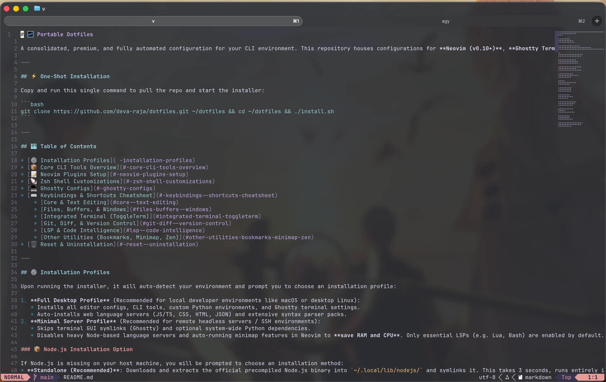

<!-- # 🌌 Portable Dotfiles -->

A consolidated, premium, and fully automated configuration for your CLI environment, natively supporting **macOS & Linux** (and Windows via WSL2). This repository houses configurations for **Neovim (v0.11+ / Stable 0.12+)**, **Ghostty Terminal**, and **Zsh** with pre-configured developer tools like `fzf`, `zoxide`, and `starship`.
### 📸 Setup Preview


---

## One-Shot Installation

Copy and run this single command to pull the repo and start the interactive installer:

```bash
git clone https://github.com/deva-raja/dotfiles.git ~/dotfiles && cd ~/dotfiles && ./install.sh
```

For a fully automated **Full Desktop** installation without prompts:

```bash
git clone https://github.com/deva-raja/dotfiles.git ~/dotfiles && cd ~/dotfiles && ./install.sh --full -y
```

---

## Table of Contents

* [⚙️ Installation Profiles](#installation-profiles)
* [🔧 Command-Line Options](#command-line-options)
* [📦 Core CLI Tools Overview](#core-cli-tools-overview)
* [📝 Neovim Plugins Setup](#neovim-plugins-setup)
* [🐚 Zsh Shell Customizations](#zsh-shell-customizations)
* [💻 Ghostty Configs](#ghostty-configs)
* [🗂️ Yazi File Manager](#yazi-file-manager)
* [⌨️ Keybindings & Shortcuts Cheatsheet](#keybindings--shortcuts-cheatsheet)
    * [Core & Text Editing](#core--text-editing)
    * [Files, Buffers, & Windows](#files-buffers--windows)
    * [Integrated Terminal (ToggleTerm)](#integrated-terminal-toggleterm)
    * [Git, Diff, & Version Control](#git-diff--version-control)
    * [LSP & Code Intelligence](#lsp--code-intelligence)
    * [Other Utilities (Bookmarks, Minimap, Zen, Markdown)](#other-utilities-bookmarks-minimap-zen-markdown)
    * [Yazi File Manager Shortcuts](#yazi-file-manager-shortcuts)
* [🛠️ Development & Sandbox Tools](#development--sandbox-tools)
* [🗑️ Reset & Uninstallation](#reset--uninstallation)

---

## Installation Profiles

Upon running the installer, it will auto-detect your environment and prompt you to choose an installation profile:

1. **Full Desktop Profile** (Recommended for local developer environments like macOS or desktop Linux):
   * Installs all editor configs, CLI tools, custom Python environments, and Ghostty terminal settings.
   * Auto-installs web language servers (JS/TS, CSS, HTML, JSON) and extensive syntax parser packs.
2. **Minimal Server Profile** (Recommended for remote headless servers / SSH environments):
   * Skips terminal GUI symlinks (Ghostty) and optional system-wide Python dependencies.
   * Disables heavy Node-based language servers and auto-running minimap features in Neovim to **save RAM and CPU**. Only essential LSPs (e.g. Lua, Bash) are enabled by default.

### 📦 Node.js Installation Option

If Node.js is missing on your host machine, you will be prompted to choose an installation method:
* **Standalone (Recommended)**: Downloads and extracts the official precompiled Node.js binary into `~/.local/lib/nodejs/` and symlinks it. This takes 3 seconds, runs entirely in user-space (no `sudo` required), and prevents system-wide package bloat.
* **System Package Manager**: Installs Node.js globally using your OS package manager (`apt-get`, `pacman`, etc.).
* **Skip**: Skips installation (note: some web LSPs inside Neovim will require manual node setup later).

---

## Command-Line Options

Both scripts (`install.sh` and `uninstall.sh`) can be customized or run non-interactively. Passing options is entirely optional; running either script without options will start the default interactive prompts.

### Installer Options (`install.sh`)

| Option | Description |
|---|---|
| `-y`, `--yes`, `--non-interactive` | Auto-accept all prompts (headless environments default to `minimal`, others default to `full`). |
| `-p`, `--profile <profile>` | Select the profile (`full` or `minimal`). |
| `--full` | Shortcut for `--profile full`. |
| `--minimal` | Shortcut for `--profile minimal`. |
| `-h`, `--help` | Show the help menu. |

### Uninstaller Options (`uninstall.sh`)

| Option | Description |
|---|---|
| `-y`, `--yes`, `--non-interactive` | Auto-accept all prompts, running the uninstallation non-interactively. *(Note: For safety, repository self-destruction is skipped).* |
| `-h`, `--help` | Show the help menu. |

---

## Core CLI Tools Overview

The installation script automatically installs and configures the following developer utilities:

* **Neovim (`nvim`):** The modern, extensible terminal text editor.
* **Starship Prompt (`starship`):** A Rust-based, customizable shell prompt showing git status, node versions, and folder context.
* **Zoxide (`z`):** A smarter `cd` command that learns your habits and lets you hop directories instantly (e.g. `z dotfiles`).
* **Fzf (`fzf`):** A command-line fuzzy finder, integrated with history, autocompletions, and directory navigation.
* **Ripgrep (`rg`):** A line-oriented search tool that is used under the hood by Telescope for ultra-fast text searches.
* **Fd-find (`fd`):** A simple, fast alternative to the `find` command, used by Telescope for listing files.
* **Yazi (`yazi`):** A blazing-fast, terminal file manager written in Rust, offering rich previews, tabbed workspaces, and fully automated directory sorting.

---

## Neovim Plugins Setup

Your Neovim configurations are split into structured, self-contained plugins under `lua/plugins/`:

### UI & Theme
* **Theme:** `rose-pine` configured for the **Moon** variant with transparent background rendering.
* **Statusline:** `lualine.nvim` auto-inherits Rose Pine colors, displaying branch name and files info.
* **UX Overlays:** `noice.nvim` replaces default prompt command lines with a floating notification layout.
* **Dashboard:** `snacks.nvim` provides an aesthetic startup dashboard.

### LSP & Code Intelligence
* **LSP Managers:** `mason.nvim` and `mason-lspconfig.nvim` to install and set up LSPs automatically.
* **Diagnostics:** `tiny-inline-diagnostic.nvim` shows clean inline errors and warnings at the end of lines.
* **Formatting:** `conform.nvim` handles automatic source code formatting.
* **Autocompletion:** `blink.cmp` manages fast, non-blocking autocomplete workflows.
* **Error Translator:** `ts-error-translator.nvim` translates complex TypeScript compiler errors into human-readable text.

### Navigation & Search
* **Fuzzy Finder:** `telescope.nvim` lists files, buffers, command histories, and search outputs.
* **File Tree:** `neo-tree.nvim` toggles your sidebar file browser.
* **Fast Hop:** `flash.nvim` lets you search and jump anywhere on the screen in 2-3 keystrokes.
* **Prevent Nesting:** `flatten.nvim` prevents spawning Neovim inside Neovim in terminal buffers.

### Git & Diffs
* **Git signs:** `gitsigns.nvim` shows modified/added/deleted line indicators in the gutter.
* **Git Client:** `neogit` provides a fully integrated terminal Git client interface.
* **Visual Diffs:** `codediff.nvim` gives side-by-side or inline diff viewing within Neovim.

### Utilities
* **Commenter:** `Comment.nvim` toggles block or line commenting.
* **Auto Save & Session:** `auto-save.nvim` and `auto-session` ensure changes are saved and terminal layouts are preserved.
* **Bookmarks:** `bookmarks.nvim` saves lines of interest per directory/project.
* **Minimap:** `mini.map` toggles a high-performance visual sidebar code minimap.
* **Zen Mode:** `zen-mode.nvim` clears the layout for focused coding.
* **Markdown Renderer:** `render-markdown.nvim` renders rich markdown headers, tables, and blocks directly in Neovim buffers.
* **Image Viewer:** `snacks.nvim`'s image module enables terminal-based image rendering inside Neovim buffers (supported in Ghostty).

---

## Zsh Shell Customizations

Sourced automatically via `zsh/custom.zsh` into your `~/.zshrc`:
* **Starship Prompt:** Beautiful, rust-powered shell headers showing branch status and language versions.
* **Syntax Highlighting:** Commands turn **green** if valid and **red** if typed incorrectly.
* **Autosuggestions:** Faint gray suggestions appear based on history.
    * Press `Ctrl + Space` to accept the suggestion **word-by-word**.
    * Press `Right-Arrow` or `End` to accept the **full line**.
* **Quick Aliases & Functions:**
    * `y` opens Yazi and automatically changes your shell's working directory to your last visited folder on exit.
    * `yc` opens Yazi with 2 tabs: Tab 1 at `~/Downloads` (sorted by birth time reverse) and Tab 2 at your current folder (focused).
    * `v` opens Neovim (`nvim`).
    * `p` runs `pnpm`.

---

## Ghostty Configs

Sets up a clean developer layout:
* **Background Opacity:** `0.90`
* **Background Blur:** `true` (enables blurred glassmorphism transparent terminals in windowed mode).

---

## Yazi File Manager

Your Yazi configuration is integrated with your terminal environment to support quick project navigations:
* **Folder-Specific Sorting Hook:** Subscribes to directory changes natively. When entering `~/Downloads` (or any subfolder), it dynamically switches the sorting to **birth time reverse (newest first, no folder-first grouping)** so downloaded items appear at the very top. Navigating away instantly restores default alphabetical sorting.
* **Dual-Tab Startup (`yc`):** Opens a dual-tab configuration: Tab 1 focused at `~/Downloads` (for copying downloads) and Tab 2 focused at your current workspace.
* **Neovim Editor Binding:** Pressing `Enter` on any text or code file automatically opens it inside **Neovim (`nvim`)** in block-mode.


---

## Keybindings & Shortcuts Cheatsheet

### Core & Text Editing
```text
Ctrl + S        ->  Save file (Normal, Insert, and Visual modes)
Cmd + S         ->  Save file (macOS modifier helper)
Cmd + C         ->  Yank selection or line to clipboard
Cmd + Z         ->  Undo changes
Cmd + Y         ->  Redo changes
J / K           ->  Move down / up by 5 lines (Fast vertical nav)
Tab / Shift-Tab ->  Indent / Outdent selection (Visual mode)
G               ->  Jump to bottom of file and center cursor (Gzz)
gn              ->  Search word currently under the cursor (*)
gj              ->  Jump cursor to first non-blank character (^)
gl              ->  Jump cursor to matching parenthesis/bracket (%)
af              ->  Initialize (Normal) / Expand (Visual) Treesitter syntax selection
<leader>p       ->  Insert a line below cursor and return to Normal mode
<Esc>           ->  Clear highlighted search outputs (nohlsearch)
<leader><Esc>   ->  Close/Quit Neovim completely (qa)
```

### Files, Buffers, & Windows
```text
Cmd + \         ->  Toggle Neo-tree sidebar (VS Code file explorer style)
<leader>w       ->  Close current active buffer
<leader>gc      ->  Close all other buffers (Close others)
<leader>h       ->  Focus window split on the Left
<leader>l       ->  Focus window split on the Right
<leader>k       ->  Focus window split on the Top
<leader>j       ->  Focus window split on the Bottom
<leader>fv      ->  Create a vertical window split
<leader>fh      ->  Create a horizontal window split
<leader>i       ->  Open Telescope file finder (uses Git files if inside a repo)
<leader>s       ->  Open Telescope live grep (global quick regex search across all files)
<leader>n       ->  Open Telescope buffer list (switch between open buffers)
<leader>;       ->  Open command palette search
<leader>?       ->  Search and list active keymaps (Telescope)
```

### Integrated Terminal (ToggleTerm)
```text
<leader>tt      ->  Toggle bottom terminal split
Ctrl + `        ->  Toggle bottom terminal split (VS Code panel shortcut style)
Cmd + J         ->  Toggle bottom terminal split
Cmd + M         ->  Focus terminal split (if in editor) or return focus to editor (if in terminal)
Esc             ->  Drop out of Terminal mode to terminal Normal mode (in terminal splits)

[Inside Active Terminal split buffer]
Cmd + N         ->  Spawn a new terminal split instance
Cmd + 8 / 9     ->  Cycle to Previous / Next active terminal split instances
Cmd + ;         ->  Open dropdown terminal instance selector picker
q               ->  Close/Destroy active terminal split process (in terminal Normal mode)
<leader>q       ->  Hide current terminal split, keeping process alive in background
```

### Git, Diff, & Version Control
```text
<leader>gl      ->  Toggle floating LazyGit window (press Esc inside to close)
<leader>dl      ->  Toggle floating LazyDocker window (press Esc inside to close)
<leader>gg      ->  Open Neogit client
<leader>gd      ->  Open Git CodeDiff (Inline single-window diff viewer)
<leader>gr      ->  Open Git CodeDiff (Side-by-Side double-window diff viewer)
<leader>gD      ->  Close CodeDiff session and close active tab
<leader>gx      ->  View git file history / diff timeline for the current buffer
<leader>gj      ->  Open Hunk Diff Viewer (Tab)
```

### LSP & Code Intelligence
```text
gd              ->  Go to definition
gD              ->  Go to declaration
gi              ->  Go to implementation
gt              ->  Go to type definition
gr              ->  Go to references list (Telescope)
gh              ->  Show LSP documentation hover popup
gf              ->  Go to file path (resolves TypeScript paths/aliases like '@/components')
<leader>e       ->  Open Telescope document symbol outline list
<leader>u       ->  Open Telescope workspace symbol search
<leader>o       ->  Run conform formatter (Format document)
<leader>rn      ->  Rename symbol under cursor
<leader>ca      ->  Open LSP code actions menu
```

### Other Utilities (Bookmarks, Minimap, Zen, Markdown)
```text
<leader>ba      ->  Add a bookmark on the current cursor line
<leader>bt      ->  Toggle/List bookmarks menu
<leader>mm      ->  Toggle visual code minimap sidebar
<leader>mf      ->  Toggle focus to/from minimap sidebar
<leader>z       ->  Toggle Zen mode (centered buffer focus, hides UI elements)
<leader>mr      ->  Toggle Markdown rich rendering (rendered view in buffer)
```

### Yazi File Manager Shortcuts
```text
y               ->  Open Yazi (Standard wrapper with shell directory change on exit)
yc              ->  Open Yazi in dual-tab mode (Tab 1: Downloads, Tab 2: Current Folder)
F               ->  Jump to a file/directory via fzf search (inside Yazi)
z               ->  Jump to a file/directory via fzf search
Z               ->  Jump to a directory via zoxide history
Enter           ->  Open selected text file in Neovim (in block-mode)
t               ->  Create a new tab
1 - 9           ->  Switch to the N-th tab
[ / ]           ->  Switch to the previous / next tab
q               ->  Close Yazi (returning to shell)
```

---

## Development & Sandbox Tools

This repository features a **Makefile** that serves as a task runner (similar to `package.json` scripts in Node.js) to automate dotfiles installation, uninstallation, and sandbox testing.

### 🛠️ Makefile Commands

To see all available commands, run:
```bash
make
```

Available targets:
* **`make install`**: Run `./install.sh` to install configurations on your host.
* **`make uninstall`**: Run `./uninstall.sh` to uninstall configurations and restore original backups on your host.
* **`make docker-build`**: Build the Docker sandbox image.
* **`make docker-run`**: Launch the Docker sandbox container interactively.
* **`make docker-sandbox`**: Clean-build and run the Docker sandbox (optionally mounting a host path as a workspace).
* **`make docker-clean`**: Clean up and remove the Docker sandbox image.

### 🌌 Isolated Sandbox Environment

If you want to preview or test changes to your dotfiles, or use your Neovim/Yazi configs to edit files on your host machine without modifying your host system, you can run them in an Ubuntu container using Docker.

Make sure Docker is running on your host machine.

#### 1. Running in Isolated Mode
To launch a clean, fully isolated container with no access to host directories:
```bash
make docker-sandbox
```

#### 2. Running in Workspace Mode (Mount Host Folders)
To use the sandbox environment to edit files on your host machine, specify the `path` parameter. This will bind-mount your host directory to `/workspace` inside the container:
```bash
# Mount the current directory
make docker-sandbox path=.

# Mount a specific project directory
make docker-sandbox path=~/projects/my-app
```

Once inside the sandbox shell, you can simply run:
* **`v` or `nvim`** to start editing your mounted host files with Neovim.
* **`y` or `yazi`** to browse your mounted files in the Yazi terminal file manager.
* **`exit`** to close and destroy the container.

---

## Reset & Uninstallation

If you ever want to revert all changes, restore your original settings from backups, and wipe caches, run the uninstaller script:

```bash
./uninstall.sh
```

*(For non-interactive uninstallation, see the [Command-Line Options](#command-line-options) section).*

This script will:
* Remove config symlinks (Neovim, Ghostty, Yazi) and **restore your original configurations** from backups (`.bak.*`).
* Clean up Neovim user directories (`~/.local/share/nvim`, `~/.local/state/nvim`, `~/.cache/nvim`) to start completely fresh.
* Uninstall system package dependencies added by the installer.
* Safely strip the custom configuration block from your `~/.zshrc`.
* Remove standalone Node.js and local bin symlinks.
* Optionally delete the repository folder itself (self-destruction).

